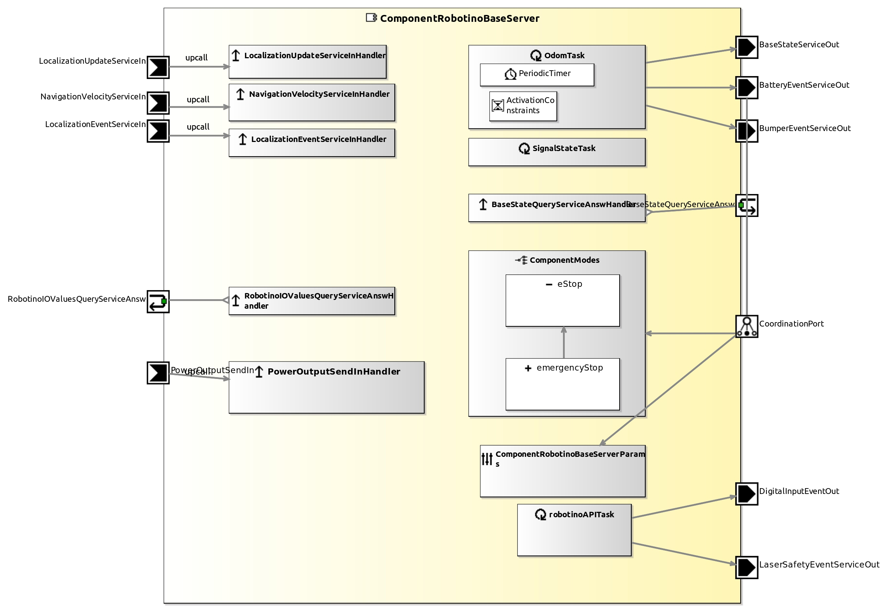

<!--- This file is generated from the ComponentRobotinoBaseServer.componentDocumentation model --->
<!--- do not modify this file manually as it will by automatically overwritten by the code generator, modify the model instead and re-generate this file --->

# ComponentRobotinoBaseServer Component

The SmartRobotinoBaseServer makes the Robotino platform available. It handles all the communication with the hardware. It offers several services for controlling the robot, such as sending navigation commands to the base and providing access to the robot's odometry. Position updates can be sent to the component to overcome odometry failures.

| Metaelement | Documentation |
|-------------|---------------|
| License | LGPL |
| Hardware Requirements | FESTO Robotino3 robot base |
| Purpose | Hardware-Driver |

## Coordination Port CoordinationPort

### States

| MainState Name | MainState Description |
|----------------|-----------------------|

### DynamicWiring

### Parameter

Accept parameters at runtime. See section Parameters.

## Service Ports

### LocalizationUpdateServiceIn

Port for corrections of base pose to overcome the odometry failure. Accepts a pair of an old uncorrected pose and a new corrected pose. The deviation between these two poses is applied to correct the current pose of the robot.

### NavigationVelocityServiceIn

Send new navigation velocity commands v and omega to hardware base. The values are thresholded by the min and max values specified in the ini file before being sent.

### BaseStateServiceOut

Push the base state containing current information about the robot's velocity, pose, raw pose. Should be used when a continuous base pose is required. For example, the SmartLaserLMS200Server uses the latest base pose (received continuously) to stamp the laser scan with the robot's pose at the time the scan was recorded.

### BaseStateQueryServiceAnsw

Query port to request the base state. Analogous to basePositionPushTimedServer, but a query service. Should be used when the base pose is needed sporadically, for example by a behavior component which explicitly needs to query the base pose from time to time.

## Component Parameters ComponentRobotinoBaseServerParams

### InternalParameter Robot

| Attribute Name | Attribute Type | Description |
|----------------|----------------|-------------|
| maxVelX | Double |  |
| maxVelY | Double |  |
| maxRotVel | Double |  |
| daemonIP | String |  |
| robotType | String |  |

### InternalParameter General

| Attribute Name | Attribute Type | Description |
|----------------|----------------|-------------|
| verbose | Boolean |  |
| hasSignalState | Boolean |  |
| useLocalizationEvent | Boolean |  |
| poseFileName | String |  |
| writePoseFile | Boolean |  |

### ParameterSetInstance BaseParams

#### TriggerInstance BASE_RESET

active = false

#### TriggerInstance BASE_SONAR

active = false

#### TriggerInstance SIGNAL_STATE_BUSY

active = false

#### TriggerInstance SIGNAL_STATE_ERROR

active = false

#### TriggerInstance SIGNAL_STATE_IDLE

active = false

#### TriggerInstance SIGNAL_STATE_LOCALIZATION_ERROR

active = false

#### TriggerInstance SIGNAL_STATE_SAFETY_FIELD

active = false

### ExtendedTrigger SET_RELAY

active = false

| Attribute Name | Attribute Type | Description |
|----------------|----------------|-------------|
| number | UInt32 |  |
| value | Boolean |  |

