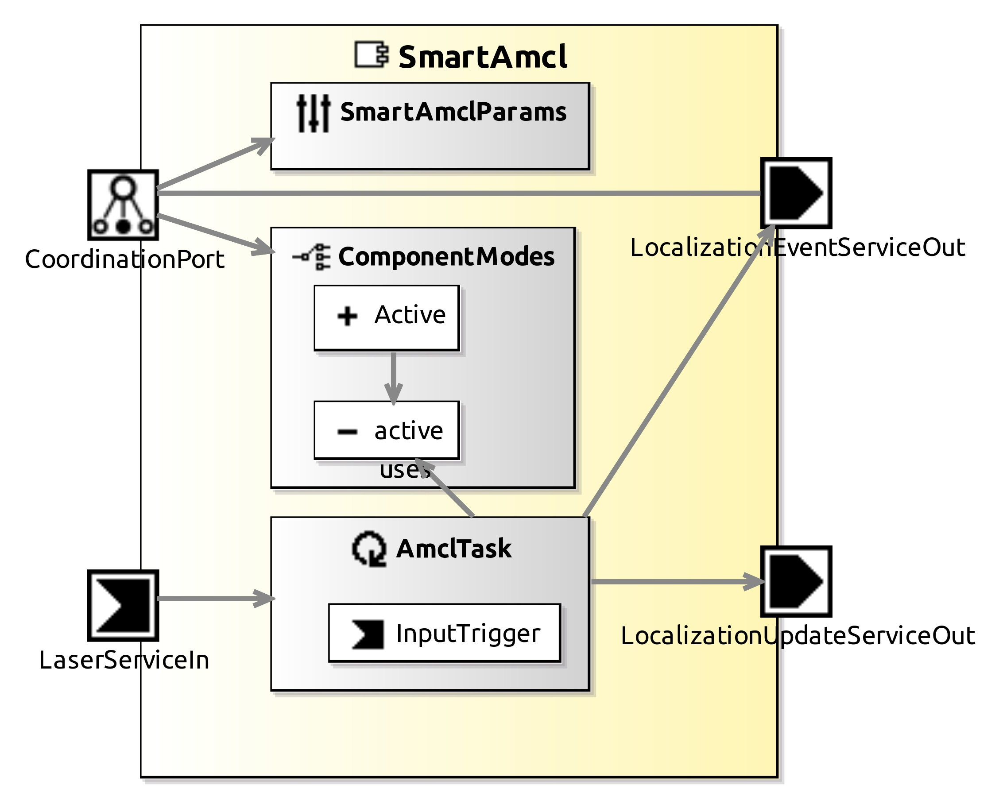

<!--- This file is generated from the SmartAmcl.componentDocumentation model --->
<!--- do not modify this file manually as it will by automatically overwritten by the code generator, modify the model instead and re-generate this file --->

# SmartAmcl Component

SmartAmcl implements the Adaptive Monte-Carlo Localization (Amcl) algorithm.
Localization is based on a particle filter and a pre-captured grid map of the environment. Amcl maintains a set of possible robot poses and updates this distribution by comparing laser scans against the pre-captured map. Amcl is adaptive because the amount of particles depends on the pose certainty: large number of particles if uncertainty increases and vice versa.

Based on its localization, SmartAmcl sends position updates to the base server (e.g. SmartPioneerBaseServer).

GPL-License: includes Code from the Player Project.

See also: http://playerstage.sourceforge.net/doc/Player-2.0.0/player/group__driver__amcl.html 

| Metaelement | Documentation |
|-------------|---------------|
| License | GPL |
| Hardware Requirements | - |
| Purpose | Navigation |

## Coordination Port CoordinationPort

### States

See States for descriptions of possible states and their meaning.

| MainState Name | MainState Description |
|----------------|-----------------------|
| Neutral | No localization is performed. No position updates will be sent. |
| Active | Localization is performed as described, position updates are sent. |

### DynamicWiring

Slave part of wiring pattern. It is responsible for changing the port connections within the component.

### Parameter

Accepts parameters to configure and trigger localization. See Parameters.

## Service Ports

### LocalizationUpdateServiceOut

Typically connected to the robot base (e.g. SmartPioneerBaseServer). This port sends position updates.

### LaserServiceIn

The laser scans that the Amcl algorithm uses for localization, e.g. from SmartLaserLMS200Server.

## Component Parameters SmartAmclParams

### InternalParameter Filter

| Attribute Name | Attribute Type | Description |
|----------------|----------------|-------------|
| min_particles | Int32 | Lower bound for amount of particles. |
| max_particles | Int32 | Upper bound for amount of particles. |
| recovery_alpha_slow | Double | Decay rates for running averages. Used in deciding when to recover by adding random poses. |
| recovery_alpha_fast | Double | Decay rates for running averages. Used in deciding when to recover by adding random poses. |
| kld_err | Double | Population size error. |
| kld_z | Double | Population size. |
| update_min_d | Double | Update filter if x or y pos delta greater than update_min_d or delta of alpha > update_min_alpha. |
| update_min_alpha | Double | Update filter if x or y pos delta greater than update_min_d or delta of alpha > update_min_alpha. |
| resample_interval | Double | The distributions will be resampled every x'th time. |

### InternalParameter Laser

| Attribute Name | Attribute Type | Description |
|----------------|----------------|-------------|
| max_beams | UInt32 | Consider at most max_beams beams from laser for localization. |
| z_hit | Double |  |
| z_short | Double |  |
| z_max | Double |  |
| z_rand | Double |  |
| sigma_hit | Double |  |
| lambda_short | Double |  |
| laser_likelihood_max_dist | Double |  |
| laser_model_type | String | Values: beam | likelihood_field. |

### InternalParameter Odometry

| Attribute Name | Attribute Type | Description |
|----------------|----------------|-------------|
| alpha1 | Double | Drift parameter/odometry error. |
| alpha2 | Double | Drift parameter/odometry error. |
| alpha3 | Double | Drift parameter/odometry error. |
| alpha4 | Double | Drift parameter/odometry error. |
| alpha5 | Double | Drift parameter/odometry error. |
| odom_model_type | String | Specifies type of odometry. Values: diff | omni. |

### InternalParameter General

| Attribute Name | Attribute Type | Description |
|----------------|----------------|-------------|
| initalizationType | InlineEnumeration |  |
| initPoseFileName | String |  |
| verbose | Boolean | Print debug messages. |
| connect_services | Boolean | UNUSED. |
| yaml_file | String | Load map and parameters from this file. |
| initial_x | Double | x value [m] of initial pose for Amcl. See also parameters. |
| initial_y | Double | y value [m] of initial pose for Amcl. See also parameters. |
| initial_a | Double | alpha/rotation [rad] of initial pose for Amcl. See also parameters. |
| initial_cov_xx | Double | Initial pose covariance x. See also parameters. |
| initial_cov_yy | Double | Initial pose covariance y. See also parameters. |
| initial_cov_aa | Double | Initial pose covariance alpha. See also parameters. |
| enable_visualization | Boolean | Show visualization window. Displays particles in map. WARNING: visualization might fail with X windows forwarding |
| lostEventMaxHypothese | UInt32 |  |
| lostEventMaxEigValueSum | Double |  |

### ParameterSetInstance LocalizationParameter

#### TriggerInstance INITIALPOSE

active = false

Set the initial pose in normal distribution. ?x = x coordinate [m], ?y = y coordinate [m], ?a = rotation in [rad].

#### TriggerInstance GLOBALLOCALIZATION

active = false

Initializes the Amcl, particles equally distributed.

#### TriggerInstance LOADMAP

active = false

